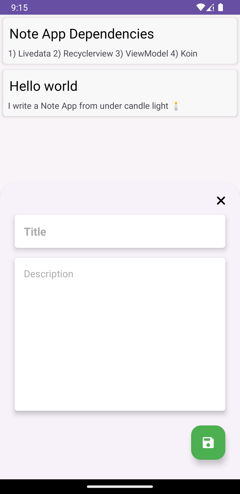

## NoteApp
Note App with Room Database, MVVM and Koin for dependency injection

## Demo
Add Note Screen |  Note List Screen
:-------------------------:|:-------------------------:
 |  

## Dependenies
- LiveData
- Room Database
- ViewModel
- Coroutines
- Koin 

## Reference
[Here](https://www.youtube.com/watch?v=Pv7bV8jde14)

### Buy me coffee ☕️
| SHIBU | BTC | ETH | DOGE |
| :----------: | :-----------: | :-----------: | :-----------: |
|  |  |  |  |
